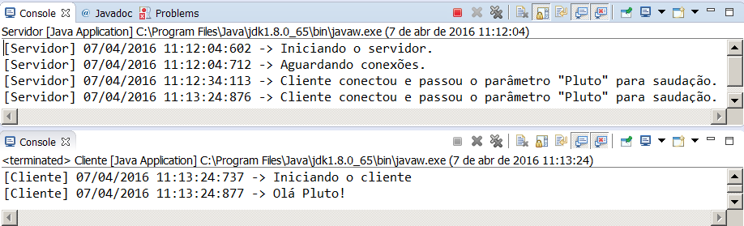

Descrição
---------
Esse programa é um exemplo muito simples de comunicação por RMI. Cada passo está propositalmente e excessivamente documentado para melhor entendimento dos alunos.

O projeto possui 3 pacotes sendo br.dagostini.cliente, br.dagostini.comum e br.dagostini.servidor. Assume-se que neste projeto há duas aplicações sendo uma o cliente e a outra o servidor, cada uma em seu pacote. Se houver uma separação em dois projetos, criando assim duas aplicações distintas, a interface que se encontra no pacote br.dagostini.comum deve estar disponível para ambos os projetos. Seja por forma de biblioteca, seja por forma de cópia.

Para testar a aplicação execute o método main da classe Servidor. Enquanto está rodando execute o método main da classe Cliente. Certifique-se de verificar ambos os consoles, servidor e cliente.
  

