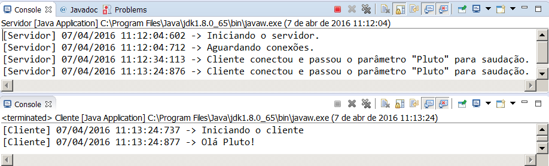

Descrição
---------

Programa quase idêntico ao P01ComunicacaoSimples.

Diferenças:

Servidor estende de UnicastRemoteObject.
Cliente busca o servidor pelo método Naming.lookup(). 

Para testar a aplicação execute o método main da classe Servidor. Enquanto está rodando execute o método main da classe Cliente. Certifique-se de verificar ambos os consoles, servidor e cliente.
  

